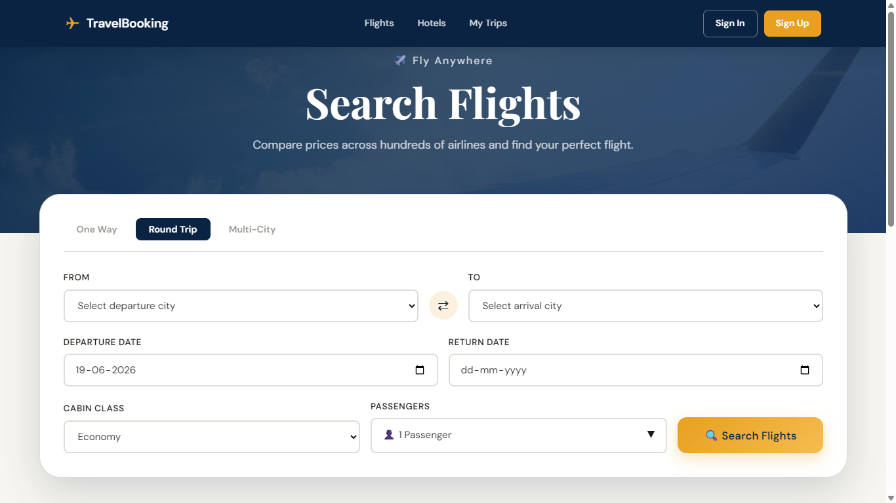
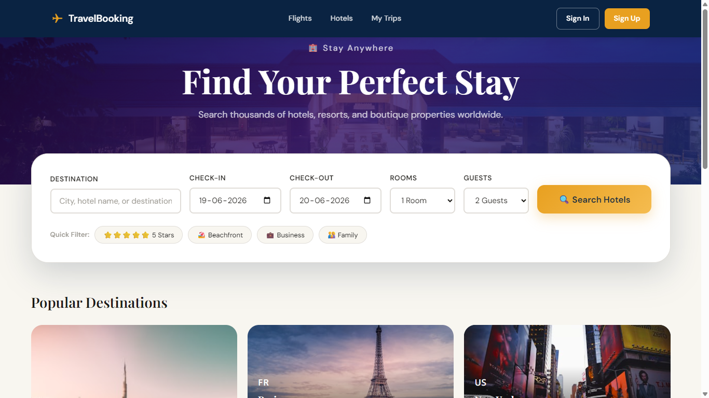
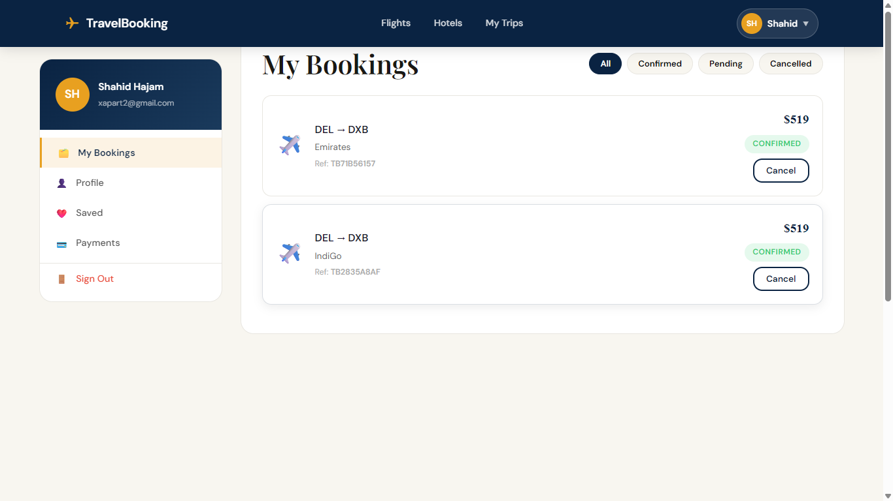

# Travel Booking

A full-stack travel booking platform with a React frontend and a Node.js/Express backend. The app supports flight and hotel search, user authentication, bookings, Razorpay payments, booking confirmations, and user profile management.

A full-stack travel booking platform...
🌐 Live Demo: https://travel-booking-puce-three.vercel.app/

## Project structure

```
travel-booking/
├── backend/                     # Express API server
│   ├── config/                  # DB + Razorpay configuration
│   ├── controllers/             # Route handlers
│   ├── middleware/              # Auth, error handling, 404
│   ├── models/                  # Mongoose schemas
│   ├── routes/                  # API routes
│   ├── utils/                   # Email helpers
│   ├── seed.js                  # Seed database helper
│   ├── package.json
│   └── server.js                # API entry point
└── frontend/                    # React single-page app
|   ├── public/
|   ├── src/
|   │   ├── components/         # Shared UI components
|   │   ├── context/            # Auth context
|   │   ├── pages/              # Page routes
|   │   ├── utils/              # API client and helpers
|   │   ├── App.js              # Router + app shell
|   │   └── index.js            # App bootstrap
|   |---package.json
|
|---Screenshots
```

## Screenshots

### Home Page


### Flight Search



### Hotel Search



### Booking Page




## Key features

- User registration and login with JWT access + refresh tokens
- Flight and hotel search flows
- Booking creation and management
- Razorpay payment integration with order creation and signature verification
- Booking confirmation email support via Gmail SMTP
- Protected frontend routes for bookings, payments, dashboard, and profile
- Rate limiting and security middleware on the API

## Tech stack

- Frontend: React, React Router, Axios, react-hot-toast
- Backend: Node.js, Express, MongoDB, Mongoose
- Auth: JWT, bcryptjs
- Payments: Razorpay
- Email: Nodemailer (Gmail)
- Security: Helmet, CORS, express-rate-limit

## Getting started

### Backend

```powershell
cd backend
npm install
copy .env.example .env  # if you add one, otherwise create backend/.env manually
npm run dev
```

### Frontend

```powershell
cd frontend
npm install
npm start
```

The frontend runs by default on `http://localhost:3000` and the backend runs on `http://localhost:5000`.

## Backend environment variables

Create a `backend/.env` file and include:

```env
PORT=5000
NODE_ENV=development
MONGODB_URI=mongodb://localhost:27017/travel_booking
JWT_SECRET=your_jwt_secret
JWT_REFRESH_SECRET=your_jwt_refresh_secret
JWT_EXPIRE=7d
JWT_REFRESH_EXPIRE=30d
CLIENT_URL=http://localhost:3000
RAZORPAY_KEY_ID=your_razorpay_key_id
RAZORPAY_KEY_SECRET=your_razorpay_key_secret
EMAIL_USER=your_gmail_address
EMAIL_PASS=your_gmail_app_password
```

> If you do not require email sending, you may omit `EMAIL_USER` and `EMAIL_PASS`, but email confirmation features will be disabled.

## Frontend environment variables

Create a `frontend/.env` file and include:

```env
REACT_APP_API_URL=http://localhost:5000/api
```

## Available scripts

### Backend

- `npm start` — run the API server
- `npm run dev` — run the API server with nodemon

### Frontend

- `npm start` — start the React development server
- `npm run build` — build the React app for production
- `npm test` — run frontend tests

## API overview

### Authentication

- `POST /api/auth/register` — register new user
- `POST /api/auth/login` — login user
- `POST /api/auth/refresh-token` — refresh access token
- `POST /api/auth/logout` — logout user
- `GET /api/auth/me` — get current user profile
- `PUT /api/auth/change-password` — change password

### Flights

- `GET /api/flights/search` — search flights
- `GET /api/flights/popular-routes` — list popular routes
- `GET /api/flights/:id` — get flight details

### Hotels

- `GET /api/hotels/search` — search hotels
- `GET /api/hotels/featured` — featured hotels
- `GET /api/hotels/:id` — hotel details
- `POST /api/hotels/:id/reviews` — add hotel review

### Bookings

- `POST /api/bookings` — create booking
- `GET /api/bookings/my-bookings` — list bookings for authenticated user
- `GET /api/bookings/:id` — get booking details
- `GET /api/bookings/reference/:ref` — get booking by reference
- `PUT /api/bookings/:id/cancel` — cancel booking

### Payments

- `POST /api/payments/create-order` — create Razorpay order
- `POST /api/payments/verify` — verify Razorpay payment
- `POST /api/payments/refund` — refund booking
- `GET /api/payments/history` — payment history

## Notes

- The frontend uses `AuthContext` and `ProtectedRoute` to guard authenticated routes.
- API requests automatically include the stored bearer token via `frontend/src/utils/api.js`.
- The backend uses MongoDB through `backend/config/db.js` and logs connection state.
- Razorpay order creation converts booking totals from USD to INR before payment processing.

## Future improvements

- Add an admin panel for managing flights, hotels, and bookings
- Add database seeding command or `.env.example` file in backend
- Integrate external travel APIs for real-time flight and hotel data
- Add Docker support for local development and deployment

## Reference

This repository contains a working frontend in `frontend/` and backend in `backend/`.
For more frontend-specific details, review `frontend/README.md`.
